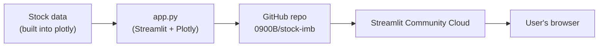
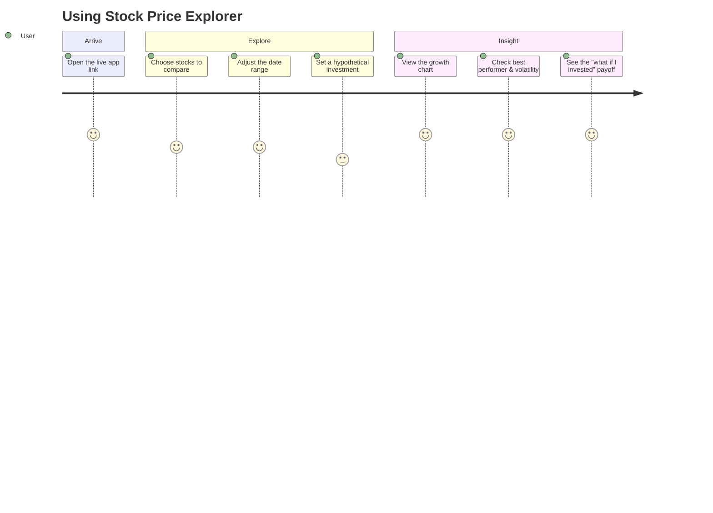

# 📈 Stock Price Explorer

A Streamlit app that compares the growth of major tech stocks (AAPL, AMZN,
FB, GOOG, MSFT, NFLX) since January 2018, built as part of the "Ship It &
Prove It" assignment.

## Live app

🔗 **[stock-imb-daehtti5izvezxuemnmpyf.streamlit.app](https://stock-imb-daehtti5izvezxuemnmpyf.streamlit.app/)**

## Features

- Pick any combination of stocks to compare on a normalized growth chart.
- Date-range slider to zoom into a specific period.
- 🏆 Automatic "best performer" metric for the stocks you've selected.
- 🌪️ "Most volatile" indicator (std dev of daily % price swings), with its own chart tab.
- 📊 Bar chart of total growth alongside the line chart.
- 💸 "What if I invested $X?" calculator for each selected stock.
- 📰 A real "Did you know?" fact about Netflix and Blockbuster.
- 🎨 Custom dark theme (`.streamlit/config.toml`) and a responsive layout that
  reflows cleanly on a phone screen.

## Architecture



## User journey



## Run locally

```bash
pip install -r requirements.txt
streamlit run app.py
```

## Reflection

The GitHub integration was the biggest time-saver — pushing files and fixing
the empty-repo edge case took seconds instead of a manual git setup. What
surprised me most was how much the "best performer" and "what if I invested"
features changed the feel of the app: the starter chart was informative, but
those two additions made it feel like a tool you'd actually hand to a boss
and not just a demo.
