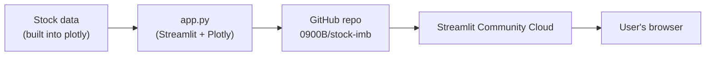
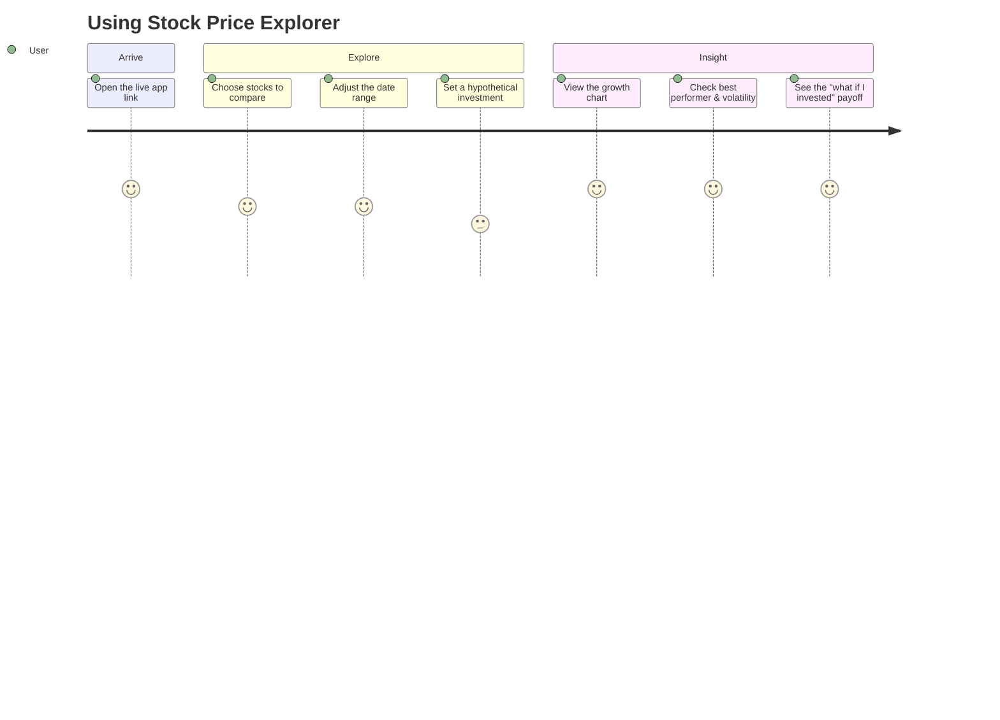

# 📈 Stock Price Explorer

A Streamlit app that compares the growth of major tech stocks (AAPL, AMZN,
FB, GOOG, MSFT, NFLX) since January 2018, built as part of the "Ship It &
Prove It" assignment.

## Live app

🔗 **[stock-imb-daehtti5izvezxuemnmpyf.streamlit.app](https://stock-imb-daehtti5izvezxuemnmpyf.streamlit.app/)**

## Features

- Pick any combination of stocks to compare on a normalized growth chart.
- Date-range slider to zoom into a specific period.
- 🏆 Automatic "best performer" metric for the stocks you've selected.
- 🌪️ "Most volatile" indicator (std dev of daily % price swings), with its own chart tab.
- 📊 Bar chart of total growth alongside the line chart.
- 💸 "What if I invested $X?" calculator for each selected stock.
- 📰 A "Did you know?" panel of 55 real stock-market fun facts that advances to
  the next fact (in order, looping back to the first) every time you reload
  the page.
- 🎨 Live in-app theme picker (sidebar → "Appearance") — switch between Dark,
  Light, Ocean, and Sunset, or pick a custom accent color, and the whole UI
  (backgrounds, charts, chips, slider, tabs) re-skins instantly.
- 📱 Responsive layout that reflows cleanly on a phone screen.

## Architecture



## User journey



## Run locally

```bash
pip install -r requirements.txt
streamlit run app.py
```

## Reflection

The GitHub integration was the biggest time-saver — pushing files and fixing
the empty-repo edge case took seconds instead of a manual git setup. The
hardest part was the live theme picker: Streamlit doesn't expose its colors
as CSS variables, so re-skinning the app on the fly meant reverse-engineering
hidden DOM structure just to recolor a single 2-pixel-tall tab indicator.
That kind of detail, plus small touches like the rotating fun facts, is what
turned a class assignment into something I'd actually hand to a boss instead
of just a demo.
