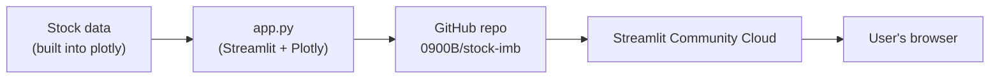

# 📈 Stock Price Explorer

A Streamlit app that compares the growth of major tech stocks (AAPL, AMZN,
FB, GOOG, MSFT, NFLX) since January 2018, built as part of the "Ship It &
Prove It" assignment.

## Live app

🔗 **[stock-explorer.streamlit.app](https://share.streamlit.io)** — link to be added once deployed on Streamlit Community Cloud.

## Features

- Pick any combination of stocks to compare on a normalized growth chart.
- Date-range slider to zoom into a specific period.
- 🏆 Automatic "best performer" metric for the stocks you've selected.
- 📊 Bar chart of total growth alongside the line chart.
- 💸 "What if I invested $X?" calculator for each selected stock.
- 📰 A real "Did you know?" fact about Netflix and Blockbuster.

## Architecture



## Run locally

```bash
pip install -r requirements.txt
streamlit run app.py
```

## Reflection

_TODO: add 3–5 lines — which MCP/tool helped most, and one thing that
surprised you._
